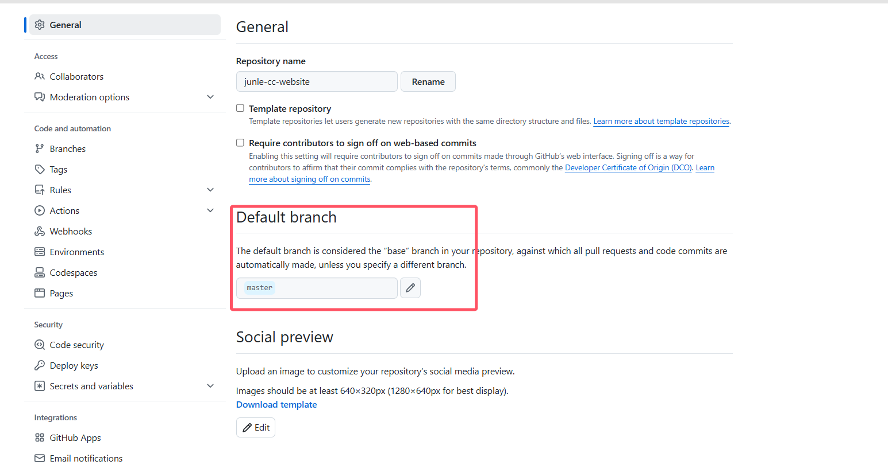
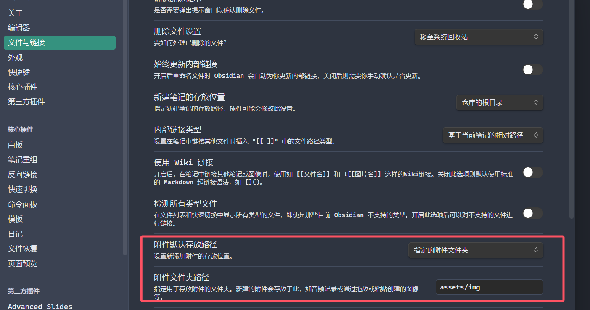

## 申请域名及配置阿里云 DNS

- 首先在阿里云上申请一个域名，我这边申请了junle.cc，需要一系列的实名认证，然后交钱即可
- 在阿里云域名管理中，将域名指向 GitHub Pages 的服务器，点击 **解析** 或 **DNS设置**
- 添加以下解析记录：
  - **主机记录**：`@`
  - **记录类型**：`CNAME`
  - **记录值**：`<username>.github.io`
  - **TTL**：默认（通常是10分钟）
- 如果你希望支持 `www.junle.cc`：
    - **主机记录**：`www`
    - **记录类型**：`CNAME`
    - **记录值**：`<username>.github.io`
- 保存配置并等待 DNS 生效

## 选择合适模板并进行fork
我这边选择了[beautiful-jekyll](https://github.com/daattali/beautiful-jekyll)模板，然后进行`fork`，设置想要的名字，我这边设置成junle-cc-website

## github page部署
在github setting 的Pages中找到`Default branch`，选择`master`并sava，确保在 **Custom domain** 中填写并保存了 `junle.cc` (申请的域名)即可

## 利用obsidian方便做笔记
`obsidian`是一个插件丰富的markdown编辑器，因此我使用`obsidian`作为编辑器，然后在图片显示在网页上会出现一些问题（jekyll貌似不支持路径是`\`开头的和在子文件夹的），这边需要新建Obsidian仓库在根目录下，然后将文件路径进行设置如下所示

