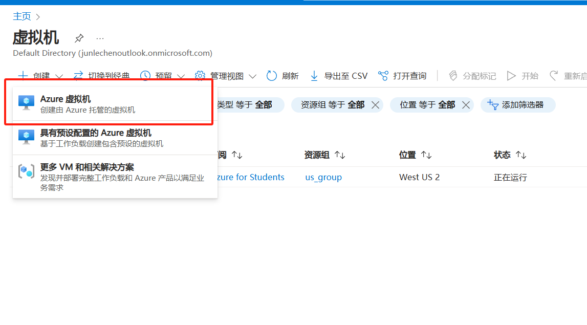
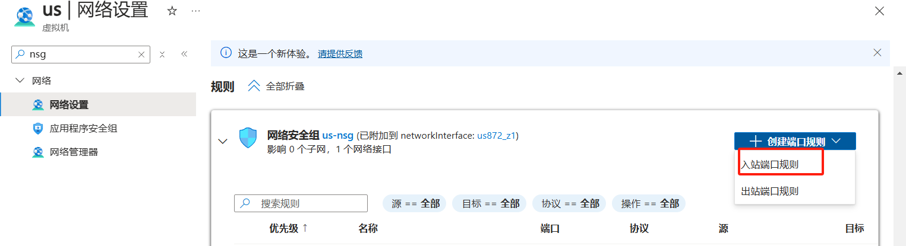

### 申请云服务器

在[github的学生权益](https://education.github.com/pack)中，可以申请Microsoft Azure的云服务器，有100美刀的券


- 在这个过程中，需要登录认证，使用校园邮箱即可，收到验证信息即可认证成功

#### 在主页创建虚拟机


- 点击虚拟机
  
- 创建虚拟机

#### 具体配置

这个是找来的图，我自己配置的时候，虚拟机命名是us，选择是us west，ubuntu 22.04，使用B1s服务器，比较便宜，然后我使用的是密码，其他默认即可。


#### 终端进入云服务器

- 通过ssh user@公网ip 进入云服务器
- 进行安装shadowsocks

```bash
sudo apt update
sudo apt install shadowsocks-libev -y
sudo vim /etc/shadowsocks-libev/config.json
```

- 配置文件

```json
{
  "server": "0.0.0.0", 
  "server_port": 8388,
  "password": "your password",
  "timeout": 86400,
  "method": "chacha20-ietf-poly1305"
}

```

- 启用服务

```bash
sudo systemctl restart shadowsocks-libev
sudo systemctl enable shadowsocks-libev
```

- 确定服务状态，active代表成功

```bash
sudo systemctl status shadowsocks-libev
```

- 配置防火墙

```bash
sudo ufw allow 8388/tcp
sudo ufw allow 8388/udp

```

#### 在Azure设置规则

设置入站规则

- **名称**：SS
- **优先级**：例如 `1000`
- **来源**：任意
- **源端口范围**：任意
- **目标**：任意
- **目标端口范围**：`8388`
- **协议**：TCP/UDP
- **操作**：允许
  

### 配置本地 Clash 客户端

**Windows**: `%USERPROFILE%\.config\clash\config.yaml`

#### 编辑config.ymal

密码自己设置

```ymal
proxies:
  - name: "Azure-SS"
    type: ss
    server: <服务器IP>
    port: 8388
    cipher: chacha20-ietf-poly1305
    password: "gx61kXwNbjU"
proxy-groups:
  - name: "Proxy"
    type: select
    proxies:
      - "Azure-SS"
      - "DIRECT"

rules:
  - DOMAIN-KEYWORD,google,Proxy
  - DOMAIN-KEYWORD,facebook,Proxy
  - GEOIP,CN,DIRECT
  - MATCH,Proxy

```

**保存并重启 Clash**

#### 导入本地配置文件


#### 成功！


